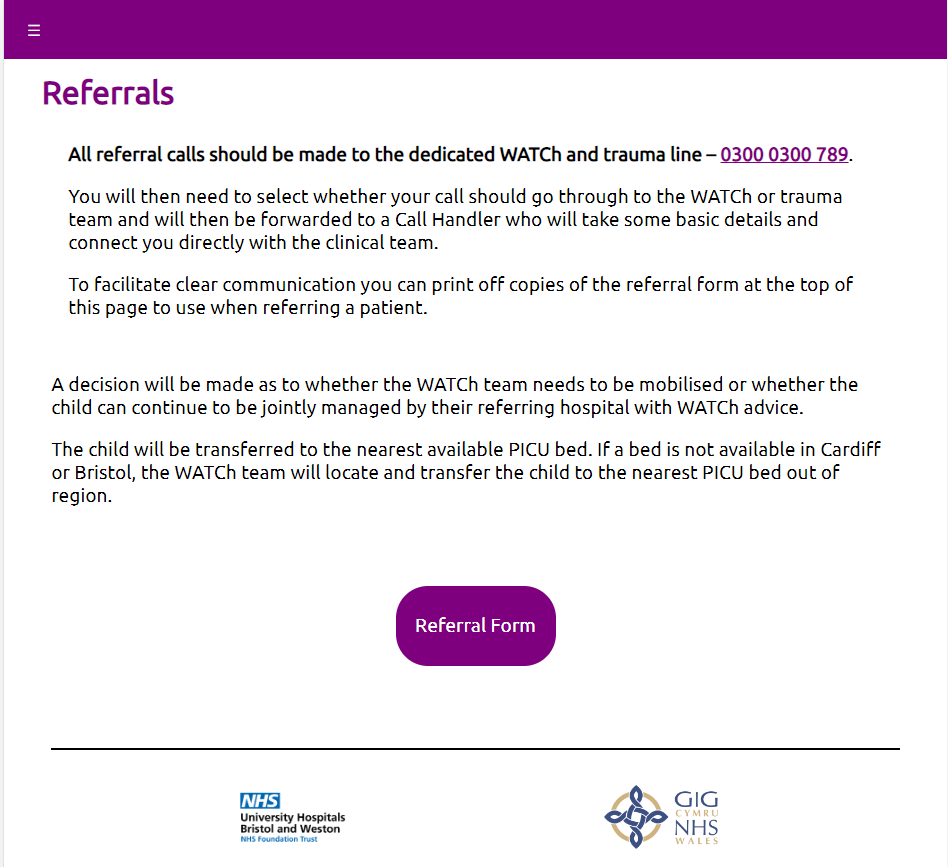
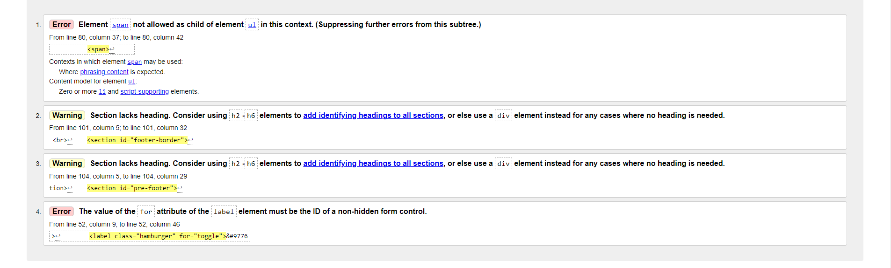

# **The Wales and West Acute Transport for Children Service (WATCh) Bristol**
## **Site Overview**
The Wales and West Acute Transport for Children Service is an ambulance team responsible for the safe transportation of critically ill children across the South West England and South Wales jointly commissioned by NHS South West England Specialist Commissioning and Welsh Health Specialised Services Committee (WHSSC). 

The WATCh team's previous website was due a required update and had a number of technical issues that needed removing. The website is intended to provide the necessary documents for the transfer of children, but also contains guidelines on how to treat children in certain conditions and provides documents to parents whose own children are in WATCh care.  

​

## Table of contents:
1. [**Site Overview**](#site-overview)
1. [**Planning stage**](#planning-stage)
    * [***Target Audiences***](#target-audiences)
    * [***User Stories***](#user-stories)
    * [***Site Aims***](#site-aims)
    * [***Color Scheme***](#color-scheme)
    * [***Typography***](#typography)
1. [**Current Features Common to all pages**](#current-features-common-to-all-pages)
    * [***Header***](#header)
    * [***Navigation Bar***](#navigation-bar)
    * [***Hamburger Navigation Menu***](#hamburger-navigation-menu)
    * [***Main Section***](#main-section)
    * [***Footer***](#footer)
1. [**Future-Enhancements**](#future-enhancements)
1. [**Testing Phase**](#testing-phase)
1. [**Deployment**](#deployment)
1. [**Tech**](#tech)
1. [**Credits**](#credits)
    * [**Honorable mentions**](#honorable-mentions)
    * [**General reference**](#general-reference)
    * [**Content**](#content)
    * [**Media**](#media)
​
## **Planning stage**
### **Target Audiences:**
* Members of WATCh
* Paediatricians responsible for the transfer of a child to WATCh care
* Parents of Children in WATCh care
​
### **User Stories:**
* As a user, I want to see learn who the WATCh team members are
* As a user, I want to be able to access the WATCh team Drug Sheet required to provide proper care to my patients quickly and efficiently.
* As a user, I want to find the WATCh 24 hour hotline
* As a user, I want to acquire the WATCh transfer sheet
​
### **Site Aims:**
* To provide all the necessary links to important WATCh files and sites
* To inform parents about the services WATCh provides when their child is being transferred to city another location to allow for proper care
* To offer the user an oppertunity to get in contact
​
### **Color Scheme:**
* For my primary colour, I chose purple rgb(127, 0, 127), to match the preexisting WATCh logo; along with a gold rgb(235, 189, 23) as a secondary colour seeing as it stands out but not too harshly

​
### **Typography**
* As per contractor's request, the only font used throughout the site is Ubuntu, the font used in their preexisting WATCh logo
* All fonts were sourced from Google fonts, as stated in the credits.

​
## **Current Features Common to all pages**

### *Header*
* The header of each page contains two logos, one WATCh logo and one NHS logo
* Both logos are responsive 

​
### *Navigation Bar*
* A responsive navigation bar that provides access to/from all pages on the site
* When a particular page is being accessed, the corresponding page name appears white to remind the user which page they are on
* When a navigation bar link is being hovered, the link will turn gold rgb(235, 189, 23)

* The about label contains a dropdown section providing the links to the "About Us" and "Team" pages
* Like the rest of the navigation bar, the dropdown section also has active and hovering qualities

### *Hamburger Navigation Menu*
* Should a user view this site on a mobile device, the navigation bar is replaced with a hamburger icon that provides links to/from all pages
* Just as the main navigation bar did, the hamburger dropdown menu is equipped with active and hover qualities

### *Main Section*
* Each page contains a main section which contains all of that particular page's information, necessary links and an accompanying photo

* Many of these pages contain a button or series of buttons that provide links to .pdf files, edexcel files, or other pages of this site
* All buttons have will turn gold rgb(235, 189, 23) when hovered over

* On the referrals, drug sheet, guidelines, family, and contact pages, which are more functional than decorational, the accompanying image will dissapear when the page width is below 950px.

### *Footer*
* The footer of each page contains two logos, one NHS logo and one GIG Logo
* Both logos are responsive 
* At the very bottom is grey bar which contains copyright details to WATCh as well as credits for myself

​

## **Future-Enhancements**
​
### *STOPP Form*
* The STOPP form is a crucial part of patient transfer, which I have currently included as button link to the pdf file on the index page. One area for improvement, however, could be to include an interactive STOPP form page on the website with its own database to transfer patients more efficiently.

## **Testing Phase**
​
### *Responsiveness*
* I used my ASUS TUF DASH F15 to write and test the site during the development phase and used Chrome Dev Tools to test for initial responsiveness with great success
* After the intial testing was complete, I used my iPhone 8+ to test whether the responsive coding worked across devices and only encountered one issue to be described later.
* I then tested my website on a different computer (TUF B550M-PLUS) on several browsers browsers including Firefox, Microsoft Edge, and Chrome once again.

### *Functionality* 
* I tested each link on the Navigation Bar from every page to ensure that they functioned properly
* I tested each link on the Hamburger Menu from every page to ensure that they functioned properly
* I tested the phone number links, both on my laptop and my pc, to ensure that they did function as telephone anchors
* I tested each guideline link to ensure that they took me to the correct pdf
* I ensured that the Drug Sheet attempts to download a local copy of the Drug-Sheet.xls page
* I ensured that each link has a target:"_blank" so that a new tab is opened when a link is opened
* I tested the email link on the contact-us page so that it would open up the mail app to send to the correct email address

### *Verification*
* I tested the html code on w3c validator, which resulted in the following issues

* Aside from the "for" "label" error, since it was not being used as a form, but rather for the hamburger icon, I fixed all errors and ran the code through again to make sure they were properly dealt with, but encountered new issues

* After fixing the "span" error, I ran the code one final time and no outsanding errors remained

* I then tested css code on the w3c validator which resulted in a single error

* After this line of code was removed, I double checked all sites to ensure that they functioned and they did, and the validator returned with no issues

* Finally, I tested my site on the Google dev tools "lighthouse" function

​
​

## **Bugs**

### iPhone 
* When the website was first opened on a mobile device, the logos in the header stretched across the screen

* This problem occured because the height of the logo was set to auto, whilst the width had been set to a particular percentage. On desktop and on dev tools repsonsive checker, this did not flag as a problem, it did, however, occur on my iPhone
* To fix this problem I set the individual height of each logo to be relative to the visible width of the screen in the media query

### List Spacing
* On the guidelines page, the list items were bunched together too closely

* This problem occured because the unordered lists that that contained the links were set to fill only be as wide as the longest list item
* To fix this problem I added padding to the unordered list so that the list items had more space to breathe

### Button Alignment
* This issue was easily the most challenging bug I encountered, but it fixing it gave me a much better understanding of how flexbox works.
* The navigation buttons at the bottom of the index page had been aligned using flexbox, which I was newly using, but the button and the underlining text were not aligned by the centre 

* The issue was being caused because the button and the text were contained in a singular div element and were being arranged by column, so they were wrapping.
* To fix this issue, I realised that I could arrange the contents of the div to be descend in rows, and by doing this they began being alinged from the centre of the top of each element

## **Deployment**
* I deployed the page on GitHub pages via the following procedure: -
​
1. From the project's [repository](https://github.com/L0rdGabbers/watch-nhs), go to the **Settings** tab.
2. From the left-hand menu, select the **Pages** tab.
3. Under the **Source** section, select the **Main** branch from the drop-down menu and click **Save**.
4. A message will be displayed to indicate a successful deployment to GitHub pages and provide the live link.

* You can find the live site via the following URL - [live webpage](https://l0rdgabbers.github.io/watch-nhs/)

​
## **Tech**
* The coding languages used to create this site were HTML and CSS
​
​
## **Credits**

### **Honorable mentions**
* Thank you to Richard Wells, for all of his advice on how to best utilise my skills and recommending other websites to improve my HTML and CSS coding
* Thank you to Rhys Webber, for allowing me to test whether my site ran on a variety of different devices and sites and for putting up with my ramblings well into the early hours of the morning
* Thank you to Madison Marriage for suggesting the Code Insitute Course to me and for, ultimately, leading me to creating this site
​
### **Content:**
* The hamburger icon was inspired from several examples provided found at: https://alvarotrigo.com/blog/hamburger-menu-css/
* All button icons were sourced from: https://fontawesome.com/search?m=freecom
* Several website photos were provided by WATCh team's very own Dr Will Marriage
* Ubuntu font was provided sourced from google fonts: https://fonts.google.com/specimen/Ubuntu?query=ubuntu
​  
### **Media:**

#### **The following images were sourced from a variety of sites, all other photos used were provided by WATCh team themselves**

* The following image was sourced from Bristol City Ambulance's Twitter Page
<blockquote class="twitter-tweet">
Our team are raring to go for day 2 of <a href="https://twitter.com/PrideCymru?ref_src=twsrc%5Etfw">@PrideCymru</a>. We wish everyone attending today a very safe and happy pride 🌈 <a href="https://t.co/YkbeO6WtHm">pic.twitter.com/YkbeO6WtHm</a>
&mdash; BRISTOL AMBULANCE (@Bristolambo) <a href="https://twitter.com/Bristolambo/status/1563849652864180227?ref_src=twsrc%5Etfw">August 28, 2022</a></blockquote>

* The following image was sourced from this site: https://www.unitetheunion.org/news-events/news/2023/january/unite-ambulance-workers-announce-strike-on-23-january/

* The following image was sourced from this site: https://mylungsmylife.org/topics/group-3/wheeze-and-your-child/what-if-my-child-is-admitted-to-hospital/

* The following image was sourced from this site: https://en.wikipedia.org/wiki/NHS_Wales

* The following image was sourced from this site: https://www.ox.ac.uk/news/2022-05-19-new-reporting-guidelines-developed-improve-ai-healthcare-settings

* The following image was sourced from this site: https://muhc.ca/newsroom/news/beware-label-prescription-drug-use

* The following image was sourced from this site: https://www.uhbw.nhs.uk/

​

​